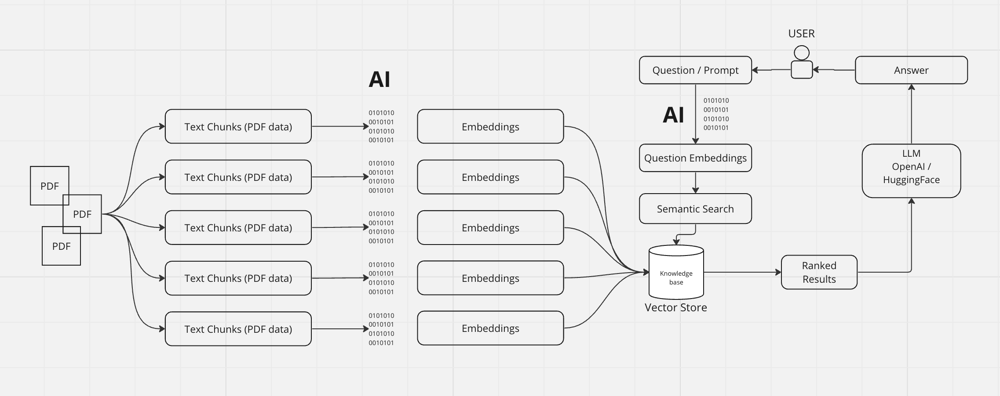

# Chat PDF - A way to chat with your Multiple PDFs

The app is hosted at HuggingFace platform : [Live](https://huggingface.co/spaces/likhithharish/Chat_PDF)

- Limitation: The live app runs on a 2core CPU and using Google [flan-t5-xxl](https://huggingface.co/google/flan-t5-xxl) model, and not OpenAI GPT3.5-Turbo / OpenAI GPT4.
- Live Demo using OpenAI GPT3.5-Turbo [HERE]()

# Summary

The MultiPDF Chat App is a Python application that allows you to chat with multiple PDF documents. You can ask questions about the PDFs using natural language, and the application will provide relevant responses based on the content of the documents. This app utilizes a language model(OpenAI / Huggingface AI) to generate accurate answers to your queries. Please note that the app will only respond to questions related to the loaded PDFs.

# Built with

- [StreamLit](https://streamlit.io/) (UI & Backend-Communication)
- [LangChain](https://python.langchain.com/docs/get_started/introduction.html) (Backend)
- [OpenAI](https://platform.openai.com/) (LLM & Embeddings)
- [HuggingFace AI](https://huggingface.co/) (LLM & Embeddings)

# How it works

# Installation

- Setup python virtual environment.
- Install dependencies specified in [requirements.txt](requirements.txt) file.
  - pip install -r requirements.txt
- Obtain [OpenAI]() API key or [HuggingFace AI] API key and setup them in a '.env' file.
  - HUGGINGFACEHUB_API_TOKEN=your_secret_key
  - OPENAI_API_KEY=your_secret_key
- Run the app as:
  - streamlit run app.py
